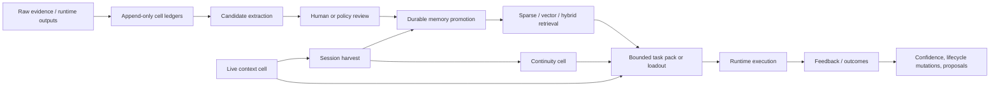
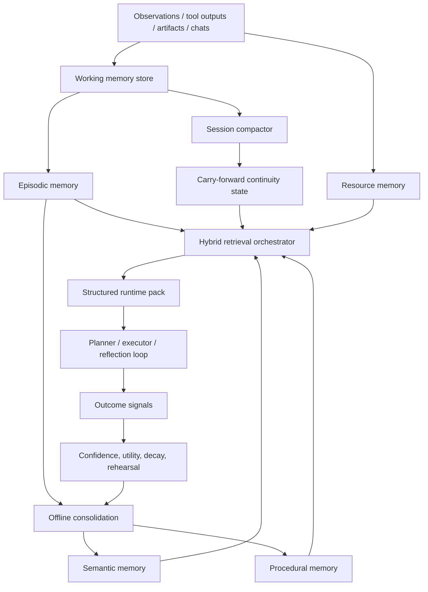
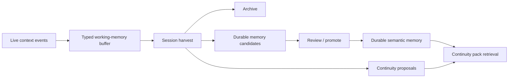

# ShyftR deep audit and frontier-memory roadmap

## Executive summary

urlShyftRhttps://github.com/stefan-mcf/shyftr is already more serious than most “agent memory” repositories. Its strongest ideas are the ones many frameworks still skip: append-only canonical ledgers, review-gated promotion into durable memory, trust-labelled retrieval, explicit lifecycle mutation, negative-space retrieval for cautions and anti-patterns, and the separation of durable memory from continuity and live working context. Conceptually, that is a sound basis for a high-integrity agent memory substrate rather than a thin vector-store wrapper. fileciteturn44file0 fileciteturn24file0 fileciteturn32file0 fileciteturn39file0 fileciteturn37file0

My central conclusion is that ShyftR’s **conceptual architecture is ahead of its current implementation quality**. The repo has the right *seams* for frontier memory, but not yet the right *algorithms* or *schema discipline*. The main bottlenecks are duplicated and drifting abstractions (`pack` versus `loadout`, public terminology versus legacy internals), several concrete consistency bugs or near-bugs in the append-only implementation, retrieval that is still largely lexical and heuristic in the newer continuity/live-context paths, and the absence of a fully developed episodic/semantic/procedural/resource hierarchy with scalable indexing and consolidation. fileciteturn60file0 fileciteturn57file0 fileciteturn24file0 fileciteturn37file0 fileciteturn39file0

Your carry-cell / continuity-cell idea is **good**, and your context-cell idea is **also good**, but both need to move from “bounded text bundle” heuristics to **typed working-state and episodic-state abstractions**. In other words: keep the idea, revise the data model and retrieval logic. As implemented today, continuity and live context are directionally correct, safe, and review-aware, but they are not yet strong enough to be called frontier agentic memory. MemGPT, recursive summarisation approaches, LightMem, Generative Agents, and MIRIX all point in the same broad direction: multi-tier memory, explicit consolidation, structured working state, and selective retrieval rather than flat memory pools. fileciteturn39file0 fileciteturn37file0 citeturn9view0turn8view1turn8view0turn11view0turn9view1

If you want ShyftR to become a frontier agentic memory system, the priority is not “add more features”. It is to **stabilise the memory model**, **separate memory classes**, **upgrade retrieval and consolidation**, **add robust evaluation**, and **treat working memory, episodic memory, semantic memory, procedural memory, and resource memory as first-class, distinct stores**. The fastest path is a disciplined evolution of the current local-first substrate, not a rewrite into an opaque vector-memory service. fileciteturn44file0 fileciteturn35file0 fileciteturn33file0 citeturn9view0turn10view0turn9view1

## Current architecture and what the codebase is doing now

At the architectural level, ShyftR is organised around **cells** as isolated memory namespaces. A cell’s append-only ledgers are treated as canonical truth; SQLite and retrieval indexes are explicitly defined as rebuildable projections or acceleration layers rather than the source of record. The public lifecycle is: ingest evidence, extract a candidate, review it, promote it to durable memory, assemble a bounded task pack, record feedback, then update confidence or spawn review-gated proposals. That local-first, event-sourced shape is coherent and unusually well thought through for an agent-memory project. fileciteturn44file0 fileciteturn24file0 fileciteturn35file0 fileciteturn60file0

The core data structures still revolve around the legacy internal vocabulary of `Source`, `Fragment`, and `Trace`, even though the public docs increasingly speak in terms of evidence, candidates, and memory. On top of that base, retrieval uses `CandidateItem`, `HybridResult`, and explicit score-component traces; pack assembly uses `LoadoutTaskInput`, `LoadoutItem`, `AssembledLoadout`, and `RetrievalLog`; lifecycle control uses `EffectiveChargeState`; frontier extensions add `GraphEdge`, `ConfidenceState`, and `EvolutionProposal`; continuity adds `ContinuityPack` and feedback records; live-context adds `LiveContextEntry`, `LiveContextPack`, and session-harvest reports. This is a rich model set, but it is also a sign that the repo now carries *two* conceptual layers at once: a mature internal ontology and a newer public-facing one. fileciteturn28file0 fileciteturn32file0 fileciteturn57file0 fileciteturn54file0 fileciteturn42file0 fileciteturn43file0 fileciteturn39file0 fileciteturn37file0

On retrieval, the code already has three tiers. Sparse retrieval uses SQLite FTS5 and BM25 over approved traces. Vector retrieval currently ships an in-memory cosine index with rebuild hooks and metadata, plus placeholder support for `sqlite-vec` and a LanceDB path in grid metadata rebuilding. Hybrid retrieval then fuses sparse and dense scores with kind/tag matching, confidence, reuse, decay, trust-tier weighting, and negative-space handling for failure signatures, anti-patterns, and supersession. This is a real design strength: it is not just “vector search”, and it has the beginnings of retrieval that can surface both guidance and warnings with explainable score traces. fileciteturn34file0 fileciteturn33file0 fileciteturn32file0

On APIs and surfaces, ShyftR exposes a broad local interface: CLI commands, an optional localhost HTTP service, an MCP bridge, a runtime/provider API, and console integration. The HTTP API exposes ingest, pack, feedback, candidate review, memory lifecycle actions, metrics, hygiene, readiness, and local cell summaries; the MCP bridge intentionally keeps destructive operations out of scope and defaults write paths to dry-run. This is consistent with the repo’s safety posture: local-first, review-gated, and operator-conscious rather than silently autonomous. fileciteturn48file0 fileciteturn49file0 fileciteturn40file0 fileciteturn44file0

The continuity and live-context work are important because they show the repo has already moved beyond static long-term memory. Continuity is intentionally separate from durable memory and offers bounded, trust-labelled packs for compaction-time carry-over, while live context is implemented as a distinct high-churn working-memory cell with session-harvest logic. In both cases the code is explicit that the runtime still owns mechanical prompt compression and that durable mutation remains review-gated or policy-gated. That separation is architecturally correct. fileciteturn39file0 fileciteturn37file0 fileciteturn25file0

That high-level diagram is faithful to both the public docs and the code: canonical ledgers, review-gated promotion, bounded packs, explicit feedback, and separate continuity/live-context paths.

### Functional module map from the secondary audit pass

The secondary audit included a concise module-by-module map of the current implementation. I am preserving it here because it is useful for onboarding, design review, and implementation planning.

| Module | Main responsibility | Main concern | Priority |
|---|---|---|---|
| `src/shyftr/ledger.py` | Canonical append/read path with hash chaining | Durable, auditable, but no explicit lock/batching; can become a bottleneck | High |
| `src/shyftr/layout.py` | Seeds cell directories and ledger files | Seeds both new and legacy vocabularies, increasing drift risk | Medium |
| `src/shyftr/models.py` | Typed records + compatibility aliases | Dual ontology (`Memory`/`Trace`, `Pack`/`Loadout`) complicates maintenance | High |
| `src/shyftr/store/sqlite.py` | Rebuildable SQLite metadata/views | Likely schema mismatches and field loss | Critical |
| `src/shyftr/retrieval/sparse.py` | FTS5 sparse retrieval | Good local baseline, but no advanced reranking or temporal logic | Medium |
| `src/shyftr/retrieval/vector.py` | In-memory vector retrieval + metadata | O(n) scan; test embedding path not production-grade | High |
| `src/shyftr/retrieval/lancedb_adapter.py` | Optional LanceDB backend | Better path for scale, but still optional and lightly integrated | Medium |
| `src/shyftr/loadout.py` | Bounded trust-aware pack assembly | Core value surface, but duplicated elsewhere | Critical |
| `src/shyftr/pack.py` | Second pack/loadout implementation | Duplication/divergence with `loadout.py` | Critical |
| `src/shyftr/continuity.py` | Continuity/carry packs and feedback | Strong abstraction, but mostly a loadout wrapper today | High |
| `src/shyftr/live_context.py` | Working-context capture, packing, harvest | Valuable concept, but current state model is still heuristic | High |
| `src/shyftr/provider/memory.py` | Simple provider facade | Useful adapter surface, but filtering semantics look inconsistent | High |
| `src/shyftr/policy.py` / `privacy.py` | Pollution checks, scope/sensitivity filtering | Good governance start, but mostly regex/rule-based | High |
| `src/shyftr/server.py` / `mcp_server.py` / `cli.py` | Delivery surfaces | Broad access surface increases drift/testing burden | Medium |
 fileciteturn44file0 fileciteturn24file0 fileciteturn39file0 fileciteturn37file0

## Code audit

The codebase is broad and disciplined in some areas. CI runs Python 3.11 and 3.12 smoke checks, terminology gates, public-readiness checks, a local lifecycle proof, a release gate, and a console build. Public status documentation also shows a wide implemented surface, from lifecycle and retrieval through privacy, continuity, distributed multi-cell features, and regulated evolution. This is not a toy repository. fileciteturn45file0 fileciteturn60file0

The strongest code-level qualities are these. First, the append-only/event-sourced philosophy is consistent across memory promotion, lifecycle mutation, continuity, evolution, and projections. Second, the retrieval layer already models uncertainty, trust tiers, supersession, and caution items rather than pretending memory is just a flat relevance ranking. Third, the continuity and live-context paths default to advisory or dry-run behaviour, which is a strong safety pattern. Fourth, privacy and policy filtering exist as explicit code paths rather than hand-wavy documentation. fileciteturn54file0 fileciteturn32file0 fileciteturn39file0 fileciteturn37file0 fileciteturn55file0 fileciteturn56file0

The deepest problems are architectural consistency problems, not syntax quality problems. The largest one is **terminology and schema drift**. Public status/docs now describe evidence, candidate, memory, pack, and feedback; much of the core code still persists `sources.jsonl`, `fragments.jsonl`, `traces/approved.jsonl`, and uses charge/pulse/spark compatibility aliases. The repo can support both, but the cost is very real: every new feature has to decide which ontology is canonical. That slows development, complicates integrations, and raises the risk of subtle breakage. fileciteturn60file0 fileciteturn28file0 fileciteturn29file0 fileciteturn30file0 fileciteturn40file0

A second major problem is **duplicated “pack” versus “loadout” logic**. The public status page still points pack generation at `src/shyftr/pack.py`, but continuity, live context, the provider facade, and the runtime integration surface all import `loadout.py`; the repo also contains both `pack_api.py` and `loadout_api.py` surfaces. That is a classic drift trap: two overlapping implementations of the same core abstraction, with downstream modules depending on one while public docs foreground the other. fileciteturn60file0 fileciteturn57file0 fileciteturn24file0 fileciteturn39file0 fileciteturn37file0 fileciteturn40file0 fileciteturn59file0

A third problem is a **likely append-only correctness bug** in confidence updates. `confidence.py` appends updated trace rows to `traces/approved.jsonl`, but `_trace_by_id()` scans the ledger and returns the first matching trace rather than the latest one. In the same codebase, `mutations.approved_traces()` explicitly collapses append-only duplicates by keeping the latest row per `trace_id`. Those two approaches conflict, and the confidence updater can therefore re-read stale state after repeated writes. In a memory system whose whole premise is append-only truth, that is a high-severity issue. fileciteturn41file0 fileciteturn54file0

A fourth problem is a **retrieval-log projection mismatch**. In `loadout.py`, `RetrievalLog.to_dict()` emits `generated_at` and does not include `cell_id`. In `store/sqlite.py`, `_rebuild_retrieval_logs()` expects `cell_id` and `logged_at`. That means the SQLite materialisation layer can silently project incomplete retrieval-log rows. This is exactly the sort of mismatch that appears when vocabulary and data contracts diverge incrementally across modules. fileciteturn57file0 fileciteturn35file0

A fifth problem is **semantic weakness in newer memory paths**. The live-context pack scorer is lexical-overlap plus small role/recency heuristics, and session harvest classification is rule-based on `entry_kind`, `retention_hint`, and sensitivity metadata. The provider search path is also a lightweight term-overlap method. These are acceptable for local deterministic MVP behaviour, but not for frontier long-running agents, because they will degrade badly under paraphrase, abstraction, multi-hop recall, long-horizon planning, and heavy scale. fileciteturn37file0 fileciteturn40file0

A sixth problem is **surface-level data scaling**. Sparse retrieval is solid for a local baseline, but vector retrieval is still in-memory by default, `sqlite-vec` is only a placeholder adapter, and the more interesting long-horizon memory paths are still ledger-scan and heuristic-score rather than indexed semantic stores. The repo is honest about this, but it means ShyftR is currently a strong local-first memory substrate, not yet a strong large-scale memory engine. fileciteturn33file0 fileciteturn34file0 fileciteturn53file0

A seventh issue is **documentation/code skew**. The public status page presents a broad stable release posture, while at least one closeout note explicitly says implementation was local in the working tree and not yet committed in that artifact. That does not mean the repo is untrustworthy; it does mean you should assume some status documents may run slightly ahead of `main`, especially around evaluation and recent tranche work. fileciteturn60file0 fileciteturn47file0

### High-priority audit findings

| Finding | Why it matters | Severity | Evidence |
|---|---|---:|---|
| Public ontology and internal ontology diverge | Increases integration cost and raises schema/ledger drift risk | High | fileciteturn60file0 fileciteturn28file0 fileciteturn29file0 fileciteturn30file0 |
| `pack` and `loadout` overlap | Creates duplicated business logic and inconsistent external contracts | High | fileciteturn60file0 fileciteturn57file0 fileciteturn24file0 fileciteturn59file0 |
| Confidence updater reads the first matching trace, not the latest | Can corrupt or flatten confidence evolution in append-only history | High | fileciteturn41file0 fileciteturn54file0 |
| Retrieval log schema mismatch between writer and SQLite projection | Weakens auditability and local analytics correctness | High | fileciteturn57file0 fileciteturn35file0 |
| Continuity/live-context retrieval is mostly lexical and heuristic | Limits correctness under paraphrase and long-horizon recall | Medium | fileciteturn39file0 fileciteturn37file0 |
| Vector index is still local baseline quality, not frontier scale quality | Limits ANN performance, multimodal retrieval, and high-volume operation | Medium | fileciteturn33file0 |
| Privacy/policy are useful but still pattern/rule oriented | Good local control, but not enough for hardened production memory | Medium |

### Additional static findings from the secondary audit pass

A second pass over the codebase surfaced several additional issues worth preserving alongside the main audit table:

- The SQLite `traces` projection appears to drop the `kind` field even though `Trace`-level semantics depend on it for ranking and role assignment. If confirmed by fixture tests, that means the SQLite materialisation is not a faithful projection of canonical memory state.
- The provider facade appears to have a trust-tier semantic mismatch: `provider.memory.search()` defaults `requested_tiers` to `["trace"]`, returns early if `"trace"` is not requested, but emits results labelled `trust_tier="memory"`. If confirmed, a caller filtering for `memory` could receive no results even when returned objects self-label as memory.
- `_current_grid_fingerprint()` appears to count rows from both `traces/approved.jsonl` and `charges/approved.jsonl` into one `charge_count`. In cells that mirror data across preferred and compatibility paths, that can double-count effectively identical memories and produce stale-index false positives.
- Testing and release confidence may be weaker than some public wording implies. The visible gates strongly emphasize `compileall`, CLI/lifecycle smoke checks, terminology/readiness checks, and optional console build/audit; the secondary audit also noted the lack of a visibly mature `pytest`/`ruff`/`mypy`/coverage stack in the public packaging metadata.
- Developer ergonomics are mixed. Positively, the project is local-first, Python-centric at its core, and exposes the same substrate through CLI, HTTP, MCP, and a provider facade, which is excellent for integration flexibility. Negatively, public vocabulary and compatibility aliases remain sprawling, and some README/manual examples lag behind the visible CLI parser, which increases confusion for new adopters.
- Security and privacy are directionally good but not yet sufficient for a system aspiring to become a hardened frontier memory substrate. The visible code includes boundary-policy regexes, scope/sensitivity controls, and a clear local trust boundary, but the broader system still lacks strong non-local authn/authz, encryption at rest, mature PII detection, and adversarial memory-poisoning defenses.
- A practical remediation order from the secondary audit is worth preserving explicitly: first collapse duplicated pack/loadout logic; second fix schema-contract mismatches and add contract tests; third unify public and legacy vocabulary so docs/examples/CLI surfaces align; fourth add regression coverage for provider, loadout, continuity, live-context harvest, and SQLite rebuild; and only then invest heavily in more advanced retrieval and compaction algorithms.

These findings do not displace the primary audit table above, but they sharpen the case for contract tests, projection-fidelity tests, stricter release-grade verification, and better sequencing of remediation work.

## Assessment of carry cells, continuity cells, and the context cell

The underlying idea is correct. Frontier agent systems need at least three distinct memory regimes: **working memory**, **carry-forward continuity memory**, and **durable long-term memory**. ShyftR already encodes this separation in its continuity and live-context modules, and that separation aligns with the strongest papers in the area: MemGPT’s tiered context management, recursive summarisation for long-term dialogue memory, Generative Agents’ observation–reflection–planning cycle, LightMem’s staged memory with offline consolidation, and MIRIX’s explicit multi-type memory hierarchy. fileciteturn39file0 fileciteturn37file0 citeturn9view0turn8view1turn11view0turn8view0turn9view1

Your **carry-cell / continuity-cell** concept is therefore not only defensible; it is one of the most strategically right concepts in the repo. Where it currently falls short is implementation depth. As coded today, continuity is effectively a bounded retrieval-and-export mechanism over durable memory with safety modes and feedback. That is useful, but it is not yet a true compacted session-state abstraction. It does not maintain a typed model of unresolved goals, commitments, hidden assumptions, tool state, or causal dependencies. It is better described as a safe, bounded continuity advisory layer than as a full continuity memory system. fileciteturn39file0

Your **context cell** idea is also right, and in the codebase it appears as the live-context cell: high-churn session entries, bounded advisory packs, and session-close harvesting. This is the correct place to solve “what must survive compression?” and “what should not become durable memory?”. The weakness is that the current implementation still stores and retrieves live context largely as flat text entries with lightweight roles and lexical scoring. That limits retrieval efficiency and correctness once sessions become long, multi-modal, or operationally complex. A frontier context cell should be an object store plus a state graph, not just a ledger of text snippets. fileciteturn37file0 fileciteturn52file0

My judgement is therefore:

- **Keep the concepts.**
- **Revise the implementation.**
- **Refine the data model from “entry blobs” to typed state objects.**
- **Move consolidation from rule-only heuristics towards structured summarisation plus offline rehearsal and graph-aware merge logic.**

Correctness is currently decent because ShyftR is conservative: advisories are bounded, writes are review-gated, and the runtime retains ownership of mechanical prompt compression. Scalability is weaker because current retrieval and harvest logic are not yet designed for very large session histories or multimodal artifacts. Retrieval efficiency is modest for local use but not frontier-grade. LLM integration is good for advisory packs and safe local integration, but not yet strong enough for automatic context reconstruction, plan-state reinstatement, or tool-grounded resumption. fileciteturn39file0 fileciteturn37file0 fileciteturn51file0 fileciteturn52file0

The right next step is to formalise these memory classes.

| Memory class | What it should contain | Should it be authoritative? | Retention |
|---|---|---|---|
| Working memory / context cell | Active goals, current plan, open loops, tool state, recent observations, unresolved contradictions | No | Minutes to session |
| Carry / continuity memory | Compact session checkpoint, high-salience state deltas, resumable intent, constraints, cautions | Advisory only | Session to days |
| Episodic memory | Timestamped episodes with provenance and outcomes | Review-gated | Days to months |
| Semantic memory | Stable facts, preferences, concepts, distilled lessons | Yes, after review | Long-term |
| Procedural memory | Skills, workflows, recovery recipes, tool-use patterns | Yes, after review and evaluation | Long-term |
| Resource memory | File references, screenshots, URLs, artifacts, code spans, external grounding handles | Yes, but by reference | Long-term |

That layered scheme is close to the direction suggested by Generative Agents, MemGPT, LightMem, and MIRIX, but still fits ShyftR’s local-first and auditable design philosophy. citeturn11view0turn9view0turn8view0turn9view1

### Additional design heuristics from the secondary audit pass

The secondary audit contributed two additional framing devices that are worth preserving because they make the carry/context design agenda more concrete.

First, it argued for a more context-sensitive confidence model. Instead of treating durable memories as carrying one scalar confidence alone, each memory should eventually track at least factual correctness, situational applicability, temporal freshness, and contradiction risk. In practical terms, that would let retrieval optimize not just for “high confidence”, but for “high confidence in this context”.

Second, it summarised common agent-memory pitfalls and the ShyftR-aligned responses they suggest:

| Pitfall in current agent systems | What ShyftR should add |
|---|---|
| Context truncation loses task state | A typed resume-state model with task DAGs, blockers, active constraints, and artifact deltas |
| Memory pollution mixes noise with truth | Stronger typed working-memory vs durable-memory boundaries, plus semantic dedupe and TTLs |
| Contradictions accumulate silently | First-class contradiction graphs, freshness windows, and automatic conflict proposals |
| Retrieval is relevance-only | Hybrid ranking with temporal, graph, confidence, novelty, and negative-space signals |
| LLM compaction loses why, not just what | Continuity packs that preserve causal chains, open loops, and verification anchors |
| Memory never forgets | Decay, archival tiers, demotion, and review-gated oblivion policies |
| Memory is uncalibrated | Per-memory calibration, uncertainty propagation, and outcome-linked update policies |
| Multi-agent teams overwrite each other | Scoped cells, federation rules, causal provenance, and merge/conflict protocols |

Those additions stay faithful to the current architecture instead of replacing it; they make ShyftR more itself, not less.

## What ShyftR is missing to become frontier agentic memory

The biggest missing capability is **first-class episodic versus semantic versus procedural separation**. Today, much of ShyftR’s durable core still centres on reviewed traces plus alloys/doctrine, while continuity and live context sit beside that core. Frontier memory systems benefit from making event episodes, distilled semantic knowledge, and procedural skill memory distinct objects with distinct write, merge, and retrieval rules. MIRIX is valuable here not because you should copy it wholesale, but because it shows the practical strength of explicit memory-type decomposition. Generative Agents also demonstrates the value of reflecting over raw experiences into higher-level memories over time. fileciteturn24file0 fileciteturn42file0 citeturn9view1turn11view0

The second missing capability is **real consolidation**. ShyftR has proposal-first evolution and some decay/confidence logic, but it does not yet have a mature sleep-time consolidation path that clusters episodes, merges paraphrastic duplicates, promotes stable concepts, prunes low-value context, and rehearses high-value memory against held-out tasks. LightMem’s main insight is especially relevant here: online memory should be cheap, while heavier consolidation can happen offline without bloating test-time cost. fileciteturn43file0 fileciteturn41file0 citeturn8view0

The third missing capability is **stronger retrieval orchestration**. Current hybrid retrieval is a good base, but frontier behaviour needs not just sparse+dense fusion, but also temporal retrieval, causal graph retrieval, scope filtering, conflict-aware reranking, negative-memory retrieval, and retrieval conditioned on current plan step and tool context. RAG and RETRO remain the foundational papers here: explicit non-parametric memory is useful not only for factual recall, but also for provenance, updateability, and scaling past the parametric model’s fixed window. ShyftR already agrees with that principle; it now needs the next layer of retrieval policy. fileciteturn32file0 citeturn10view0turn10view1

The fourth missing capability is **multimodal/resource memory as a first-class citizen**. The repo’s live-context and continuity surfaces are text-centric, even if the surrounding docs discuss runtime context more broadly. If you want a genuinely groundbreaking system, the next leap is not merely “store longer conversations”; it is “remember what the agent saw, clicked, edited, opened, and produced”, with references back to screenshots, file locations, tool outputs, and code spans. MIRIX’s results on ScreenshotVQA are relevant because they show that memory systems become meaningfully more useful when they can store and retrieve rich resource memory, not just text snippets. fileciteturn37file0 citeturn9view1

The fifth missing capability is **grounded plan-state memory**. Many agent failures are not factual-recall failures; they are failures to preserve task state, commitments, pending branches, environment assumptions, or tool state. ShyftR’s live-context cell is pointed at this problem, but the representation is not yet sufficiently structured. Frontier agentic memory needs a state layer that answers questions like: *what was the agent trying to do, which assumptions were active, which tool outputs mattered, what failed, what is still unresolved, and what exactly should be reloaded on resume?* That is where your context-cell idea can become especially strong. fileciteturn37file0 fileciteturn39file0

The sixth missing capability is **robust evaluation and calibration**. The repo already includes deterministic local metrics, synthetic continuity evaluation, and frontier confidence baselines, which is good. But frontier memory claims need benchmarked retrieval quality, answer faithfulness, memory utility, stale-memory suppression, contradiction avoidance, token/cost efficiency, task success lift, and calibration quality over time. LongBench, LoCoMo, and LightMem’s use of LongMemEval show why this matters: simple long-context tests are not enough, and memory systems need separate evaluation for recall, reasoning, and efficiency. fileciteturn47file0 fileciteturn39file0 citeturn7view1turn7view0turn8view0

## Comparative position against Mem0 and Hermes

The secondary audit included a useful competitive framing against Mem0 and Hermes Agent's default memory. That comparison is preserved here because it clarifies where ShyftR is already differentiated and where it still trails more production-oriented retrieval systems.

| Capability | ShyftR | Mem0 | Hermes default memory |
|---|---|---|---|
| Canonical source of truth | Append-only cell ledgers are explicit canonical truth; indexes are rebuildable acceleration. | Managed/open-source memory layer that stores layered memory and merges it at query time; docs emphasise operational layers more than a ledger-first canon. | Two flat files (`MEMORY.md`, `USER.md`) injected into the system prompt, plus session-search over SQLite FTS5. |
| Memory hierarchy | Strong conceptual hierarchy: evidence/candidate/memory/pattern/rule plus continuity/live-context cells. | Explicit conversation/session/user/org layers, plus graph/reranker features in platform docs. | Built-in persistent memory is simple and bounded; session search is separate. |
| Review and governance | Strongest of the three: explicit promotion, lifecycle mutation, sensitivity/export policy, and audit ledgers. | Offers enterprise controls and governance in platform docs, but the public model is oriented around managed memory operations rather than a review-gated ledger lifecycle. | Minimal built-in governance; public issue discussions explicitly call out missing contradiction detection and richer cognitive memory behaviour. |
| Retrieval sophistication today | Better-than-basic local stack, but still modest: FTS5, in-memory vectors, optional LanceDB, hybrid pack assembly. | Stronger production retrieval story on paper: layered retrieval, graph memory, rerankers, async infrastructure, and benchmarked token efficiency. | Weakest built-in retrieval: flat memory injection plus session search. |
| Operational simplicity | Medium. More principled, but more moving parts. | High for teams wanting a service; lower transparency. | Highest. Simple files, simple limits, simple tooling. |
| Provenance and auditability | Excellent design intent; stronger than both comparators. | Present in a product-governance sense, but less visibly ledger-centric in public docs. | Weak in built-in memory; better only if paired with external providers or session logs. |
| Frontier readiness | Conceptually promising, implementation not yet frontier-grade. | Closest to production-grade retrieval/memory stack among the three. | Best as a simple local personal-memory baseline, not a frontier agent-memory platform. |

The practical conclusion from that comparison is straightforward: ShyftR is currently strongest when you care about memory as a governed substrate — provenance, scoping, replayability, mutation history, sensitivity controls, continuity cells, and live-context separation. Mem0 is stronger if your immediate goal is a production-grade retrieval layer with layered memory types, graph/rerank infrastructure, and benchmark-backed token efficiency. Hermes’ built-in memory is the lightest-weight and easiest to reason about, but also intentionally much simpler.

## Recommended target architecture and component choices

The best target architecture for ShyftR is **not** “replace ledgers with a vector database”. The right move is to preserve the append-only local-first ledger model and add a more explicit memory hierarchy, better indexes, and stronger consolidation.

This target architecture preserves ShyftR’s safety model while upgrading it into a genuine multi-tier memory system. It is also strongly aligned with the research direction across MemGPT, recursive summarisation, Generative Agents, LightMem, and MIRIX: tiered memory, explicit consolidation, selective retrieval, and a clear distinction between immediate working state and durable long-term memory. fileciteturn44file0 fileciteturn39file0 fileciteturn37file0 citeturn9view0turn8view1turn11view0turn8view0turn9view1

### Concrete design changes

The first change should be a **unified canonical schema**. Internally, pick one ontology and make everything else an adapter layer. My recommendation is to keep the historical append-only ledgers, but formalise a canonical memory object with fields like: `memory_id`, `memory_type` (`working`, `continuity`, `episode`, `semantic`, `procedure`, `resource`, `rule`), `scope`, `time_interval`, `provenance_refs`, `grounding_refs`, `confidence_state`, `utility_state`, `lifecycle_state`, `sensitivity`, and `embedding_refs`. Public evidence/candidate/memory terminology can stay, but only as a stable external contract. fileciteturn60file0 fileciteturn28file0 fileciteturn42file0

The second change should be a **typed working-memory model** for the context cell. Instead of generic text entries, store structured records such as `goal`, `subgoal`, `plan_step`, `constraint`, `decision`, `assumption`, `artifact_ref`, `tool_state`, `error`, `recovery`, `open_question`, and `verification_result`. Each should carry timestamps, parent links, evidence refs, and TTL. This would immediately improve carry-over correctness, retrieval precision, and plan resumption. fileciteturn37file0

The third change should be a **real episodic store**. Every materially important session segment should become an episode with actors, timestamps, outcomes, tools used, referenced resources, and extracted candidate lessons. Durable semantic memory should then be distilled from episodes, rather than written directly from raw text whenever possible. That follows the reflection/consolidation direction in Generative Agents and the staged-memory logic in LightMem. citeturn11view0turn8view0

The fourth change should be **retrieval orchestration by policy**, not by one score only. The orchestrator should combine lexical, dense, temporal, structural, and utility signals, with special handling for contradictions, supersession, and negative memory. At retrieval time, it should answer: what is relevant, what is current, what is risky, what is stale, what is missing, and what is the cheapest pack that preserves task success? RAG and RETRO provide the general retrieval principle; BigBird and similar sparse-attention work are relevant because they remind you not to rely on giant context windows alone when selective retrieval is cheaper and usually safer. fileciteturn32file0 citeturn10view0turn10view1turn11view1

The fifth change should be **sleep-time consolidation and rehearsal**. After sessions, cluster episodes, deduplicate semantically equivalent items, promote stable concepts, propose procedural skills, archive low-value context, and rehearse high-importance memory against held-out or synthetic tasks. ExpeL is useful here because it shows how agents can learn from experience without weight updates, and LightMem is useful because it separates online memory use from offline update cost. citeturn9view2turn8view0

The sixth change should be **first-class resource memory**. Add artifact-backed memory objects that point to files, screenshots, URLs, notebook cells, code regions, and tool outputs. If a memory item says “this build broke because the migration changed column X”, it should be able to point at the exact diff, log span, or screenshot. That will make ShyftR more than a conversation memory system; it will make it an agent environment memory system. citeturn9view1

### Recommended components

| Layer | Near-term recommendation | When to use something heavier |
|---|---|---|
| Canonical truth | Keep append-only JSONL ledgers | Only replace if you leave the local-first design entirely |
| Local sparse retrieval | urlSQLite FTS5https://www.sqlite.org/fts5.html | Keep unless you need cross-node serving |
| Local vector retrieval | Start with urlsqlite-vechttps://github.com/asg017/sqlite-vec or keep a cleaned-up local ANN layer | Move to a dedicated service only when scale forces it |
| Multimodal / columnar local search | Consider urlLanceDBhttps://lancedb.com | Use when image/resource memory becomes central |
| Distributed ANN | Consider urlQdranthttps://qdrant.tech only if multi-user or high-volume distributed retrieval becomes necessary | Do not adopt early if local-first remains the product stance |
| Graph memory | Start with an append-only graph-edge ledger; later optionally add urlNeo4jhttps://neo4j.com if graph queries become dominant | Only after graph traversal is proven to matter materially |
| Dense retrieval implementation | urlFAISShttps://github.com/facebookresearch/faiss or a local ANN wrapper | Use if you want a stronger local ANN baseline before any service split |
| Validation / object contracts | Keep or expand typed schemas and contract tests | Mandatory before any major API widening |

The strategic rule is simple: **preserve local-first ergonomics as long as possible**. ShyftR’s differentiator is not “we also have a database”; it is “memory is inspectable, portable, scoped, and reviewable”. The component choices should protect that. fileciteturn44file0 fileciteturn53file0

### Frontier additions that fit the current substrate

A complementary way to think about the upgrade path is not only in terms of component choices, but in terms of capability additions that extend ShyftR's existing ledger-and-governance model.

| Frontier addition | Why it fits ShyftR | Practical implementation |
|---|---|---|
| HNSW/ANN vector backend | Replaces current O(n) in-memory cosine scan for real scale | Make LanceDB or another ANN backend a first-class, tested default for non-test cells, while retaining ledgers as truth |
| Query-aware reranking | Lets packs optimise for resume utility, not just lexical/semantic overlap | Add a reranker stage over candidate items using trust, recency, conflict, graph, and continuity signals |
| Temporal memory index | ShyftR’s big gap today is freshness and chronology | Add per-item valid-time, observed-time, expiry, and contradiction intervals; rank with temporal decay and recency windows |
| Typed artifact-state store | Needed for compaction and long-running tool use | Store current file/artifact/tool state as typed slots, hashes, and deltas rather than generic notes |
| Semantic deduplication | Prevents memory rot and aggressive duplicate promotion | Add MinHash/SimHash or embedding-neighbour dedupe before promotion and during harvest |
| Consolidation service | Turns ledgers into self-improving memory rather than just stored memory | Periodic jobs that cluster memories, propose patterns/rules, and suggest demotions/archives |
| Privacy-preserving storage | Important if the project graduates beyond local-only use | Field-level sensitivity tags, encrypted payloads, redactable projections, and provable export filters |
| Evaluation harness | Essential for credibility | Reproducible LoCoMo/LongMemEval-style adapters plus ShyftR-specific compaction/resume benchmarks |

These recommendations are direct extensions of the existing codebase direction: graph hooks, confidence-state scaffolding, retrieval modes, continuity/live-context modules, and a rebuildable index philosophy are already present. The challenge is turning those hooks into one coherent memory engine.

## Roadmap, experiments, and evaluation protocol

### Prioritised roadmap

| Milestone | Scope | Time | People | Success criteria |
|---|---|---:|---:|---|
| Stabilise the core | Unify pack/loadout, fix confidence stale-read bug, fix retrieval-log schema mismatch, freeze canonical ontology, add migration/adapters | 2–4 weeks | 1–2 engineers | Zero known consistency bugs in append-only paths; green CI; no duplicate core pack logic |
| Introduce typed working and episodic memory | Add typed context/state records, explicit episode objects, carry-state objects, artifact/resource refs | 4–6 weeks | 2 engineers | Session resume quality improves; carry packs become more accurate and smaller |
| Upgrade retrieval | Add semantic ANN path, temporal reranking, graph-aware reranking, utility-aware reranking, contradiction suppression | 4–6 weeks | 2 engineers | Better recall/precision on long-session tasks at acceptable p95 latency |
| Add offline consolidation and rehearsal | Sleep-time cluster/merge/promote/archive pipeline, duplicate merge proposals, procedural skill proposals, rehearsal tasks | 6–8 weeks | 2–3 engineers | Lower token cost, lower stale recall, higher task-success lift over baseline |
| Add multimodal/resource memory | Screenshot/file/code span resource memory, multimodal references, grounding hooks | 6–10 weeks | 2–3 engineers | Better performance on artifact-heavy workflows and screenshot/resource tasks |
| Harden privacy and evaluation | Field-level privacy labels, stronger policy engine, poisoning tests, benchmark harness, calibration metrics | 4–6 weeks | 1–2 engineers | Measurable safety posture and trustworthy benchmark reporting |

Those estimates assume the current local-first design remains intact, frontier API backbones are pluggable rather than trained in-house, and the first target is a strong single-node or small-team deployment rather than hosted multi-tenant infrastructure. fileciteturn44file0 fileciteturn53file0

### Recommended experiments

The first experiment should be **current ShyftR versus unified-core ShyftR**. Use the same synthetic and operator-approved task traces, then compare task success, pack token count, memory precision@k, stale-memory recall, harmful-memory inclusion rate, and operator review burden before and after the ontology/bug-fix tranche. This is the fastest way to prove that consistency work is not “cleanup only”, but materially useful. fileciteturn47file0 fileciteturn60file0

The second experiment should be **heuristic continuity/live-context versus typed continuity/live-context**. Use multi-session tasks where later success depends on preserved decisions, constraints, failures, and open loops. Measure carry-state correctness, resume success, pack size, and missing-state rate. This directly validates whether your carry/context concepts are implemented well enough, rather than only sounding plausible. fileciteturn39file0 fileciteturn37file0

The third experiment should be **online-only versus offline consolidation**. Compare no-consolidation, rule-based proposal-only consolidation, and sleep-time consolidation with rehearsal. Measure semantic duplication, retrieval latency, memory drift, operator burden, and downstream task success. LightMem strongly suggests that offline consolidation can reduce cost and improve utility simultaneously. citeturn8view0

The fourth experiment should be **resource-memory grounding**. Build tasks where correct answers depend on remembered screenshots, file contents, log spans, or code fragments rather than conversation text alone. MIRIX’s multimodal results argue that this is where memory systems can pull sharply ahead of vanilla RAG and long-context prompting. citeturn9view1

### Additional experiments, visualisations, and continuity framing

The secondary audit proposed several extra evaluation tasks that complement the four experiments above and help ensure the eventual benchmark programme covers both correctness and operator usability:

- **Harvest classification benchmark**: label session-close entries as discard/archive/continuity/memory/skill and measure precision/recall of the harvest classifier.
- **Memory hygiene benchmark**: track duplicate rate, stale-memory rate, contradiction rate, and harmful-memory survival rate over time.
- **Latency and throughput benchmark**: measure append latency, pack latency, index rebuild time, and token cost versus corpus size so scaling thresholds are explicit.

It also suggested a useful set of supporting visualisations:

- an architecture diagram that separates canonical ledgers, acceleration layers, and application layers;
- a continuity lifecycle flowchart from live capture to harvest to promotion proposal;
- a comparison heatmap for ShyftR vs Mem0 vs Hermes across provenance, retrieval, governance, scale, and simplicity;
- a performance chart showing pack latency versus corpus size for in-memory vectors vs an ANN backend;
- an evaluation chart showing compaction-recovery quality under fixed token budgets.

A continuity-oriented diagram from the secondary audit is preserved below because it usefully sharpens the distinction between working state, continuity proposals, and durable memory promotion:

That model reinforces the larger point of this report: the target is not one flat memory bucket, but a governed hierarchy in which working state, episodic state, semantic state, and procedural/rule state each have their own lifecycle.

### Benchmarks and datasets I would use

| Benchmark / dataset | Why it matters for ShyftR |
|---|---|
| LoCoMo | Very long conversational memory, temporal/causal dynamics, QA and summarisation |
| LongMemEval | Useful for measuring long-term conversational memory quality and efficiency because recent memory systems report against it |
| LongBench | Measures long-context understanding across multiple task types, not just one memory pattern |
| ScreenshotVQA | Strong fit if you add multimodal/resource memory |
| ShyftR native synthetic fixtures | Needed to validate review gates, lifecycle correctness, policy filtering, and operator-local workflows |

LoCoMo is particularly important because it targets very long-term conversational memory over many sessions and explicitly shows that long-context LLMs and RAG help but still lag human performance. LongBench is helpful because it reminds you that broad long-context competence is multi-task, and LightMem is a useful recent reference because it reports both quality and efficiency on LongMemEval and LoCoMo rather than quality alone. citeturn7view0turn7view1turn8view0

### Concrete evaluation protocol

For each benchmark or internal task suite, I would evaluate six classes of metrics.

| Metric family | Concrete measures |
|---|---|
| Retrieval quality | Precision@k, Recall@k, MRR, nDCG, contradiction rate, stale-memory inclusion rate |
| Answer quality | Exact match / F1 where available, citation correctness, faithfulness to evidence |
| Memory utility | Task success lift over no-memory baseline, harmful-memory rate, ignored-memory rate, missing-memory rate |
| Efficiency | Tokens per successful task, API calls per task, p50/p95 retrieval latency, pack size |
| Stability | Performance over time, duplicate growth rate, semantic drift, supersession correctness |
| Calibration | Brier score or ECE over confidence/usefulness predictions, challenge/deprecate precision |

Use at least four ablations in every serious report: no memory; durable memory only; durable + continuity; durable + continuity + live context; and then the fully improved tiered-memory system. That is the minimum needed to show whether each memory layer adds real value or just extra machinery. fileciteturn47file0 fileciteturn39file0 fileciteturn37file0

## Assumptions and open questions

I have assumed that the target deployment remains **local-first or single-node first**, that your target models will be a mix of frontier API LLMs and local/open-weight backbones, and that you care about **auditability and memory correctness more than absolute minimal latency**. If your real target is high-throughput hosted multi-tenant memory, some storage recommendations would change materially. fileciteturn44file0 fileciteturn53file0

I have also assumed that “frontier agentic memory” for you means more than raw recall. I have treated it as the combination of: durable provenance, session resumption, long-horizon planning support, multimodal grounding, contradiction handling, low-cost compaction, offline consolidation, and measurable task lift. That interpretation is consistent with the repo’s own stated ambitions and with the strongest recent memory-system papers. fileciteturn24file0 citeturn9view0turn11view0turn8view0turn9view1

The biggest unresolved questions are these:

- Which target runtimes and LLMs matter most: frontier hosted APIs, local models, or both?
- Is ShyftR meant to remain a transparent operator memory substrate, or evolve into an autonomous memory manager?
- Do you need only text memory, or also code, files, screenshots, browser state, and tool traces?
- What is the acceptable write-latency and retrieval-latency budget?
- Is cross-user / cross-team federation a real requirement, or mostly a future option?

### Methodological caveats from the secondary audit pass

The secondary audit was explicit that its conclusions were drawn from static analysis of repository materials and external primary or near-primary documentation rather than end-to-end execution of the system. That caveat is important: some findings are strong static contract observations, but the most operationally important ones should still be confirmed with focused regression fixtures.

In particular, the retrieval-log projection mismatch, the provider-search trust-tier inconsistency, and any CLI/docs/example alias drift should be treated as high-priority verification targets immediately after design consolidation work begins. Likewise, the Mem0 and Hermes comparisons are useful framing devices, but they rely largely on official documentation and public discussions rather than on independent reproduction.

If you answer those clearly in design docs and align the schema around them, ShyftR can become genuinely distinctive. My final assessment is that **the repo already contains the right core ideas**. What it needs now is not a new slogan, but a ruthless consolidation of ontology, a stronger typed memory hierarchy, better retrieval and consolidation algorithms, and a benchmark discipline strong enough to prove that its memory is not just persistent, but actually useful. fileciteturn60file0 fileciteturn43file0 citeturn10view0turn9view0turn8view0turn9view1turn7view0turn7view1